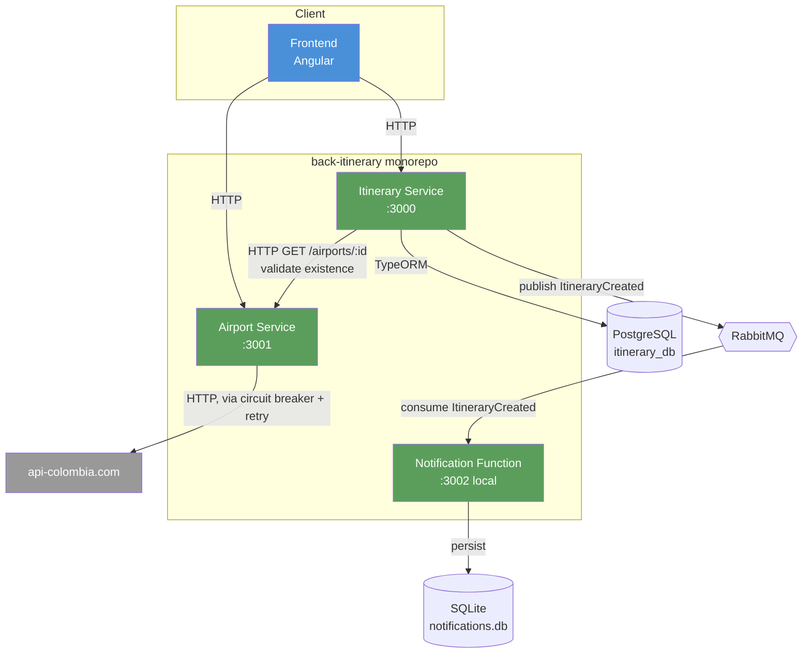
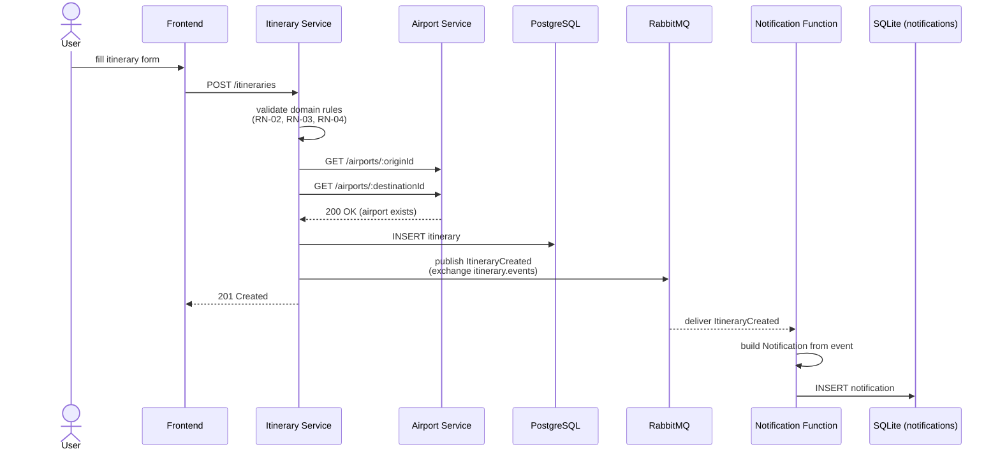
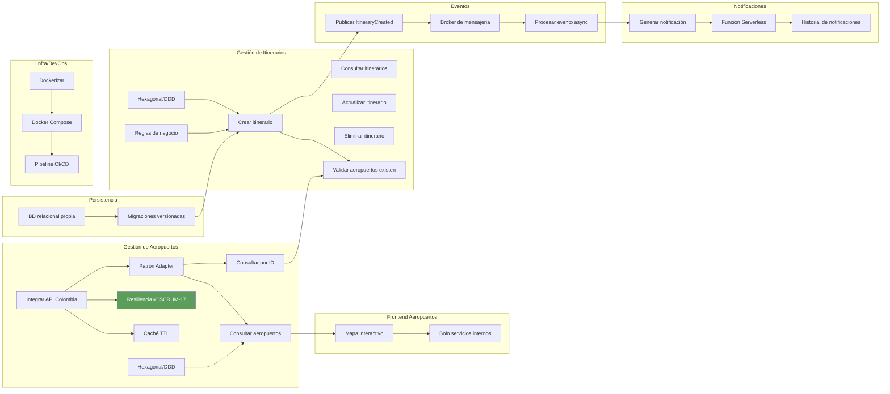

# Architecture diagrams

Reference diagrams for the backend. Keep these updated when a ticket adds a
new service, port, adapter, or event — see the [backend-hexagonal skill](../.claude/skills/backend-hexagonal/SKILL.md)
for the conventions these diagrams describe.

## Component diagram

**Rule enforced by this diagram:** the frontend never calls `api-colombia.com`
directly (SCRUM-14/"Frontend consume solo servicios internos"), and no service
reaches into another service's database — `notification-function`'s SQLite
store is private to it, same as `itinerary-service`'s Postgres instance.

## Event flow: itinerary creation → notification

If Airport Service is unreachable (`AirportProviderUnavailableError` /
circuit breaker open), Itinerary Service's validation call fails and the
itinerary is **not** persisted — no event is published, so no ghost
notification is ever generated (RN-06).

## Backlog dependency graph (Sprint-planning aid)

Which epics/tickets block which — use this to sequence remaining work instead
of picking tickets in CSV order. Arrows mean "must exist before this can be
meaningfully implemented or tested end-to-end."

Practical read: the Airport Service epic (A2/A3/A4/A5, already mostly built)
gates both the frontend map and the itinerary-creation validation flow — it
was the right epic to start with. The next highest-leverage gap is closing
**A6 (caché TTL)** since it's a small, isolated addition to the same adapter
touched in SCRUM-17, followed by **I5/I6** (already scaffolded in
`itinerary-service`, mostly needs the failure-path test called out in
SCRUM's "Validar existencia de aeropuertos" acceptance criteria) before
moving into the Eventos/Notificaciones chain, which already has a working
skeleton end-to-end.
